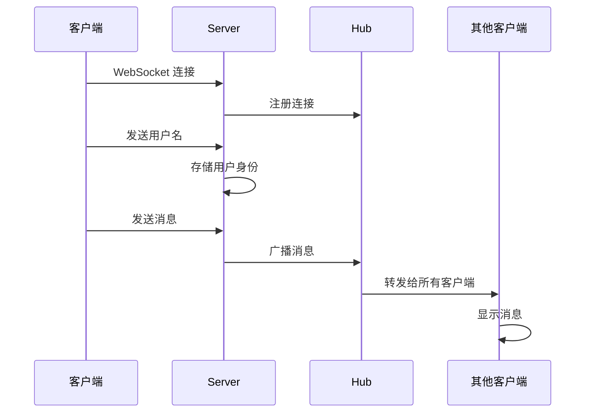

# 🚀 WebSocket 实时聊天室

一个基于 Go + WebSocket + HTML5 实现的现代化实时聊天室应用，支持多用户同时在线聊天、心跳检测、自动重连等功能。


## 📋 目录

- [功能特性](#功能特性)
- [技术架构](#技术架构)
- [项目结构](#项目结构)
- [实现原理](#实现原理)
- [安装运行](#安装运行)
- [使用说明](#使用说明)
- [技术细节](#技术细节)

## ✨ 功能特性

### 🔥 核心功能
- **实时通讯**：基于 WebSocket 协议的双向实时通信
- **多用户支持**：支持多个用户同时在线聊天
- **用户身份识别**：每个用户有独立的用户名标识
- **消息广播**：消息实时广播给所有在线用户

### 🛡️ 稳定性保障
- **心跳检测**：服务端定期发送 ping，客户端自动响应 pong
- **自动重连**：网络断开时自动尝试重连（最多5次）
- **连接状态监控**：实时显示连接状态和重连进度
- **异常处理**：完善的错误处理和连接清理机制

### 🎨 用户体验
- **现代化UI**：响应式设计，支持移动端
- **消息区分**：区分自己和他人的消息显示
- **实时状态**：连接状态实时反馈
- **键盘快捷键**：支持回车键发送消息

## 🏗️ 技术架构

### 后端架构
```
┌─────────────────┐    ┌─────────────────┐    ┌─────────────────┐
│   Gin Router    │────│   WebSocket     │────│      Hub        │
│   (HTTP/WS)     │    │   Upgrader      │    │   (消息中心)     │
└─────────────────┘    └─────────────────┘    └─────────────────┘
         │                       │                       │
         │                       │                       │
         ▼                       ▼                       ▼
┌─────────────────┐    ┌─────────────────┐    ┌─────────────────┐
│   Static File   │    │     Server      │    │   Broadcast     │
│   (index.html)  │    │   (连接管理)     │    │   (消息广播)     │
└─────────────────┘    └─────────────────┘    └─────────────────┘
```

### 前端架构
```
┌─────────────────┐    ┌─────────────────┐    ┌─────────────────┐
│   HTML5 UI      │────│   WebSocket     │────│   Event Loop    │
│   (聊天界面)     │    │   Client        │    │   (事件处理)     │
└─────────────────┘    └─────────────────┘    └─────────────────┘
         │                       │                       │
         │                       │                       │
         ▼                       ▼                       ▼
┌─────────────────┐    ┌─────────────────┐    ┌─────────────────┐
│   CSS Styling   │    │   Auto Reconnect│    │   Message       │
│   (响应式设计)   │    │   (自动重连)     │    │   Handler       │
└─────────────────┘    └─────────────────┘    └─────────────────┘
```

## 📁 项目结构

```
ChatRoom/
├── main.go                 # 应用入口，路由配置
├── go.mod                  # Go 模块依赖管理
├── go.sum                  # 依赖版本锁定
├── index.html              # 前端聊天界面
├── README.md               # 项目文档
└── chatRoom/               # 聊天室核心模块
    ├── hub.go              # 消息中心，负责消息广播和连接管理
    └── server.go           # WebSocket 服务器，处理单个连接
```

## 🔧 实现原理

### 1. 消息流转机制



### 2. 核心组件详解

#### Hub（消息中心）
- **职责**：统一管理所有 WebSocket 连接，负责消息广播
- **核心机制**：
  - `Register chan *Server`：新连接注册通道
  - `Unregister chan *Server`：连接断开注销通道
  - `Broadcast chan []byte`：消息广播通道
  - `Servers map[*Server]struct{}`：活跃连接存储

```go
// Hub 的核心运行逻辑
func (h *Hub) Run() {
    for {
        select {
        case server := <-h.Register:    // 处理新连接
            h.Servers[server] = struct{}{}
        case server := <-h.Unregister: // 处理断开连接
            delete(h.Servers, server)
        case message := <-h.Broadcast: // 广播消息给所有连接
            for server := range h.Servers {
                server.msg <- message
            }
        }
    }
}
```

#### Server（连接管理）
- **职责**：管理单个 WebSocket 连接的读写操作
- **核心机制**：
  - `Read()`：从客户端读取消息，第一条作为用户名，后续消息广播
  - `Write()`：向客户端发送消息
  - `heartBeat()`：心跳检测，定期发送 ping 消息

```go
// 消息读取逻辑
func (s *Server) Read() {
    for {
        _, message, err := s.conn.ReadMessage()
        if len(s.frontName) == 0 {
            s.frontName = message  // 第一条消息作为用户名
        } else {
            // 后续消息格式："用户名:消息内容"
            s.hub.Broadcast <- bytes.Join([][]byte{s.frontName, message}, []byte(":"))
        }
    }
}
```

### 3. 心跳检测机制

#### 服务端实现
```go
func heartBeat(conn *websocket.Conn, pongWait time.Duration, pingPeriod time.Duration) {
    // 设置 pong 处理器
    conn.SetPongHandler(func(string) error {
        conn.SetReadDeadline(time.Now().Add(pongWait))
        return nil
    })
    
    // 定时发送 ping
    ticker := time.NewTicker(pingPeriod)
    for {
        select {
        case <-ticker.C:
            conn.WriteMessage(websocket.PingMessage, []byte{})
        }
    }
}
```

#### 客户端实现
```javascript
// WebSocket 自动处理 ping/pong
ws.addEventListener('ping', function() {
    console.log('收到ping，发送pong响应');
    // WebSocket 协议自动处理 pong 响应
});
```

### 4. 自动重连机制

```javascript
ws.onclose = function(event) {
    // 非正常关闭且未超过重连次数
    if (event.code !== 1000 && reconnectAttempts < maxReconnectAttempts) {
        reconnectAttempts++;
        setTimeout(() => {
            reconnect(); // 3秒后重连
        }, reconnectInterval);
    }
};
```

## 🚀 安装运行

### 快速开始

1. **克隆项目**
```bash
git clone <repository-url>
cd ChatRoom
```

2. **安装依赖**
```bash
go mod tidy
```

3. **启动服务**
```bash
go run main.go
```

4. **访问应用**
```
浏览器打开：http://localhost:8080
```

## 📖 使用说明

### 基本使用流程

1. **进入聊天室**
   - 打开浏览器访问 `http://localhost:8080`
   - 输入用户名（1-20个字符）
   - 点击"连接"按钮

2. **发送消息**
   - 在消息输入框输入内容
   - 按回车键或点击"发送"按钮
   - 消息会实时显示给所有在线用户

3. **查看消息**
   - 自己的消息显示在右侧（蓝色背景）
   - 他人的消息显示在左侧（灰色背景）
   - 系统消息居中显示（浅蓝色背景）

### 连接状态说明

- 🟢 **已连接到聊天室**：正常在线状态
- 🟡 **连接断开，X秒后尝试重连**：自动重连中
- 🔴 **连接已断开**：需要手动重新连接
- ✅ **重连成功**：自动重连恢复

## 🔍 技术细节

### 依赖库说明

```go
// 核心依赖
require (
    github.com/gin-gonic/gin v1.10.1      // HTTP 框架
    github.com/gorilla/websocket v1.5.3   // WebSocket 实现
)
```

### 配置参数

#### 服务端配置
```go
const (
    pongWait   = 5 * time.Second  // Pong 等待超时
    pingPeriod = 3 * time.Second  // Ping 发送间隔
)
```

#### 客户端配置
```javascript
let maxReconnectAttempts = 5;    // 最大重连次数
let reconnectInterval = 3000;    // 重连间隔（毫秒）
```

### 消息格式

#### 用户身份标识
```
第一条消息："用户名"
```

#### 聊天消息
```
发送格式："消息内容"
广播格式："用户名:消息内容"
```

### 性能优化

1. **连接池管理**：使用 map 高效管理活跃连接
2. **异步处理**：读写操作分离，避免阻塞
3. **内存管理**：连接断开时及时清理资源
4. **心跳优化**：合理的心跳间隔，平衡性能和稳定性

### 安全考虑

1. **跨域处理**：生产环境需要配置合适的 CORS 策略
2. **输入验证**：用户名和消息长度限制
3. **连接限制**：可添加单IP连接数限制
4. **消息过滤**：可添加敏感词过滤

## 🤝 贡献指南

个人学习的小功能，欢迎指正


---

**享受实时聊天的乐趣！** 🎉# -
